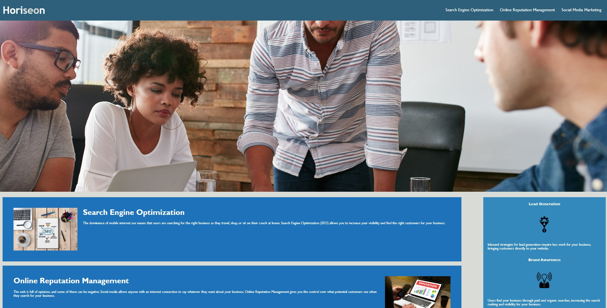

# Huss' Horiseon

For the week 1 challenge I made some changes to the accessibility features to the HTML and CSS. The company that the changes were made for was Horiseon a marketing company. 

## Actions Taken:
* Made changes to the CSS coding by grouping similar items together
* Created a read me file with what I did. 
* Changed styling features for the HTML & CSS files. 
* Added alternative source  of images when the picture is not available in the HTML. 

## Screenshot:

         
     

     

## Links
GitHub repository link: https://github.com/hussrizk56/HussHoriseon

URL to deployed application: https://hussrizk56.github.io/HussHoriseon/
